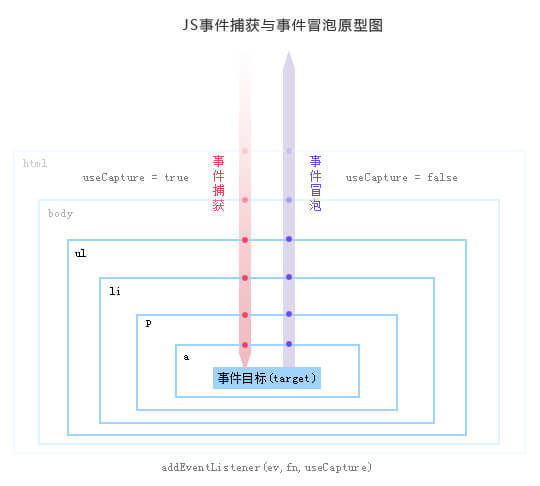

# Js 中事件绑定、事件代理和事件委托

## 事件绑定

在 JavaScript 中，有三种常用的绑定事件的方法：

- 在 DOM 元素中直接绑定；

  ```html
  <input id="myButton" type="button" value="点我" onclick="alert('普通事件1');">
  ```

- 在 JavaScript 代码中绑定；

  ```js
  document.getElementById("myButton").onclick=function () {
    alert('普通事件2'); // 通过这种方式绑定的事件将会覆盖上面的 alert('普通事件1') 方法
  }
  ```

- 绑定事件监听函数。

  ```js
  document.getElementById("myButton").addEventListener('click', a); // 通过这种方式不能用 onclick 要用 click
  document.getElementById("myButton").addEventListener('click', b);
  function a() {
    alert('事件监听1'); //执行
  }
  function b() {
    alert('事件监听2'); //执行
  }
  ```

更多事件，详见 MDN：[事件类型一览表 | MDN](https://developer.mozilla.org/zh-CN/docs/Web/Events) 或者 [HTML DOM 事件对象 | 菜鸟教程](http://www.runoob.com/jsref/dom-obj-event.html)

关于 `addEventListener()`：[EventTarget.addEventListener() - Web API 接口| MDN](https://developer.mozilla.org/zh-CN/docs/Web/API/EventTarget/addEventListener)


## 事件委托（事件代理）
事件委托（也被称作事件代理）就是利用冒泡的原理，把事件加到父元素或祖先元素上，触发执行效果。



### 基本实现

比如我们有这样的一个 HTML 片段：

```html
<ul id="list">
  <li>item 1</li>
  <li>item 2</li>
  <li>item 3</li>
  ......
  <li>item n</li>
</ul>
```

我们来实现把 `#list` 下的 `li` 元素的事件代理委托到它的父层元素也就是 `#list` 上：

```js
// 给父层元素绑定事件
document.getElementById('list').addEventListener('click', function (e) {
  // 兼容性处理
  var event = e || window.event;
  var target = event.target || event.srcElement;
  // 判断是否匹配目标元素
  if (target.nodeName.toLocaleLowerCase === 'li') {
    console.log('the content is: ', target.innerHTML);
  }
});
```

如果我们想更精确地匹配到某一类 `#list li` 元素上，可以使用 `Element.matches` API。

但是该 API 存在兼容性问题，我们可以自己做一层 **Polyfill**：

```js
if (!Element.prototype.matches) {
  Element.prototype.matches =
    Element.prototype.matchesSelector ||
    Element.prototype.mozMatchesSelector ||
    Element.prototype.msMatchesSelector ||
    Element.prototype.oMatchesSelector ||
    Element.prototype.webkitMatchesSelector ||
    function(s) {
      var matches = (this.document || this.ownerDocument).querySelectorAll(s),
          i = matches.length;
      while (--i >= 0 && matches.item(i) !== this) {}
      return i > -1;            
    };
}
```

然后我们就可以愉快的使用 `Element.matches` 啦：

```js
document.getElementById('list').addEventListener('click', function (e) {
  // 兼容性处理
  var event = e || window.event;
  var target = event.target || event.srcElement;
  if (target.matches('li.class-1')) {
    console.log('the content is: ', target.innerHTML);
  }
});
```

### 封装

这里就有几个关键点：

- 对于父层代理的元素可能有多个，需要一一绑定事件；
- 对于绑定的事件类型可能有多个，需要一一绑定事件；
- 在处理匹配被代理的元素之中需要考虑到兼容性问题；
- 在执行所绑定的函数的时候需要传入正确的参数以及考虑到 this 的问题；

```js
/**
 * @param String parentSelector 选择器字符串, 用于过滤需要实现代理的父层元素，既事件需要被真正绑定之上
 * @param String targetSelector 选择器字符串, 用于过滤触发事件的选择器元素的后代，既我们需要被代理事件的元素
 * @param String events 一个或多个用空格分隔的事件类型和可选的命名空间，如 click 或 keydown.click
 * @param Function callback 代理事件响应的函数
 */
function eventDelegate (parentSelector, targetSelector, events, callback) {
  // 触发执行的函数
  function triFunction (e) {
    // 兼容性处理
    var event = e || window.event;

    // 获取到目标阶段指向的元素
    var target = event.target || event.srcElement;

    // 获取到代理事件的函数
    var currentTarget = event.currentTarget;

    // 处理 matches 的兼容性
    if (!Element.prototype.matches) {
      Element.prototype.matches =
        Element.prototype.matchesSelector ||
        Element.prototype.mozMatchesSelector ||
        Element.prototype.msMatchesSelector ||
        Element.prototype.oMatchesSelector ||
        Element.prototype.webkitMatchesSelector ||
        function(s) {
          var matches = (this.document || this.ownerDocument).querySelectorAll(s),
            i = matches.length;
          while (--i >= 0 && matches.item(i) !== this) {}
          return i > -1;            
        };
    }

    // 遍历外层并且匹配
    while (target !== currentTarget) {
      // 判断是否匹配到我们所需要的元素上
      if (target.matches(targetSelector)) {
        var sTarget = target;
        // 执行绑定的函数，注意 this
        callback.call(sTarget, Array.prototype.slice.call(arguments))
      }

      target = target.parentNode;
    }
  }

  // 如果有多个事件的话需要全部一一绑定事件
  events.split('.').forEach(function (evt) {
    // 多个父层元素的话也需要一一绑定
    Array.prototype.slice.call(document.querySelectorAll(parentSelector)).forEach(function ($p) {
      $p.addEventListener(evt, triFunction);
    });
  });
}
```

使用：
```js
eventDelegate('#list', 'li', 'click', function () { console.log(this); });
```

### 优点

1. 提高 JavaScript 性能。事件委托比起事件分发（即一个 DOM 一个事件处理程序），可以显著的提高事件的处理速度，减少内存的占用。
2. 动态的添加 DOM 元素，不需要因为元素的改动而修改事件绑定。 

### 局限性

当然，事件委托也是有一定局限性的；

比如 `focus`、`blur` 之类的事件本身没有事件冒泡机制，所以无法委托；

`mousemove`、`mouseout` 这样的事件，虽然有事件冒泡，但是只能不断通过位置去计算定位，对性能消耗高，因此也是不适合于事件委托的；

## 总结

- 适合用事件委托的事件：`click`，`mousedown`，`mouseup`，`keydown`，`keyup`，`keypress`。
- 所有的鼠标事件中，只有 `mouseenter` 和 `mouseleave` 不冒泡，其他鼠标事件都是冒泡的。

### 参考资料
> [JavaScript事件绑定和事件监听的区别 - AC_greener的博客 - CSDN博客](https://blog.csdn.net/AC_greener/article/details/78602422)
> 
> [JS 中的事件绑定、事件监听、事件委托是什么？ - 前端 - 掘金](https://juejin.im/entry/57ea329e67f3560057ad41a6)
> 
> [JS中的事件委托或是事件代理详解 · Issue #25 · yonyouyc/blog · GitHub](https://github.com/yonyouyc/blog/issues/25)
> 
> [mouseenter、mouseover；mouseleave、mouseout的区别 - BobScript](https://bobscript.com/archives/292/)
> 
> [JavaScript 事件委托详解 - 知乎](https://zhuanlan.zhihu.com/p/26536815)