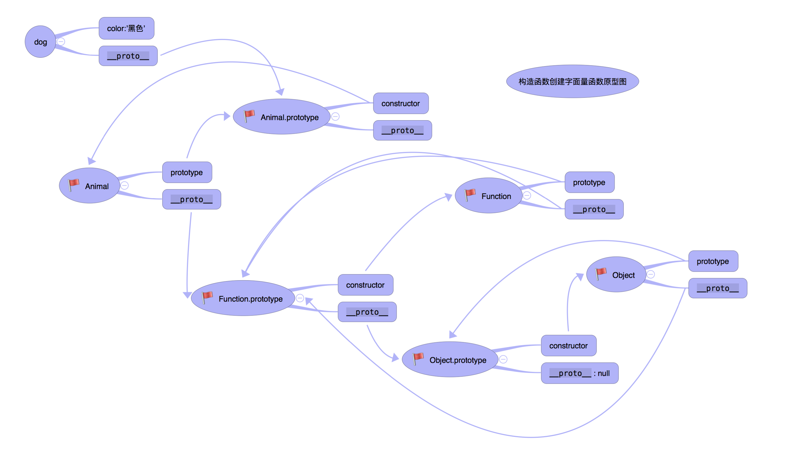
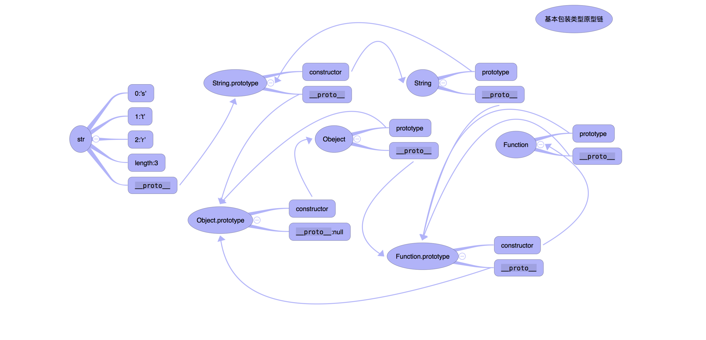

# 理解 JavaScript 的原型及原型链

## 常见理论

* 所有的引用类型（数组、对象、函数），都具有对象特性，即可自由扩展属性（null 除外）
* 所有的函数，都有一个 `prototype` 属性，属性值是一个普通的对象
* 所有的引用类型（数组、对象、函数），都有一个 `__proto__` 属性，属性值也是一个普通的对象，指向它的**构造函数**的 `prototype` 属性值

## 自我总结

- 所有函数（当然，构造函数也是函数）的 `__proto__` 都指向 `Function.prototype` 因为它们都是 `Function` 的实例。
- 所有函数的 `prototype` 都是一个对象，这个对象有 `constructor` 和 `__proto__` 属性，`constructor` 指向函数自己，`__proto__` 指向 `Object.prototype`（因为 `prototype` 前面说了，也是一个对象）。

❗️只有 `Object` 构造函数的 `prototype` 例外，它的 `__proto__` 指向的 **null**，即
```js
Object.prototype.__proto__ === null
```

**此外**：

- 只要是对象（包括函数），就一定有 `__proto__`，指向它的构造函数的 `prototype`（`__proto__` 一定指向的构造函数的 `prototype`，因为都是构造函数的实例，`Object.prototype.__proto__ === null` 除外）
- 只要是函数，都有 `prototype`，这个 `prototype` 是一个对象，包括 `constructor` 和 `__proto__`。

## 通过代码解释

```js
// 要点一：自由扩展属性
var obj = {}; obj.a = 100;
var arr = []; arr.a = 100;
function fn () {}
fn.a = 100;

// 要点二：__proto__
console.log(obj.__proto__);
console.log(arr.__proto__);
console.log(fn.__proto__);

// 要点三：函数有 prototype
console.log(fn.prototype)

// 要点四：引用类型的 __proto__ 属性值指向它的构造函数的 prototype 属性值
console.log(obj.__proto__ === Object.prototype) // true
```

## 图解





## 原型链

当试图得到一个对象的某个属性时，如果这个对象本身没有这个属性，那么会去它的 `__proto__`（即它的构造函数的 prototype）中寻找。（因为如果在 `f.__proto__` 中没有找到 `toString`，那么就继续去 `f.__proto__.__proto__` 中寻找，因为 `f.__proto__` 就是一个普通的对象而已嘛！）

这说明一个对象所拥有的属性不仅仅是它本身拥有的属性，它还会从其他对象中继承一些属性。当 js 在一个对象中找不到需要的属性时，它会到这个对象的父对象上去找，以此类推，这就构成了对象的原型链。

既然如此，我们如何判断这个属性是不是对象本身的属性呢？

使用 `hasOwnProperty`，判断。如：`f. hasOwnProperty("toString")`。

## 参考资料
> [深入浅出javascript对象原型 - 简书](https://www.jianshu.com/p/aa2f885ba871)
