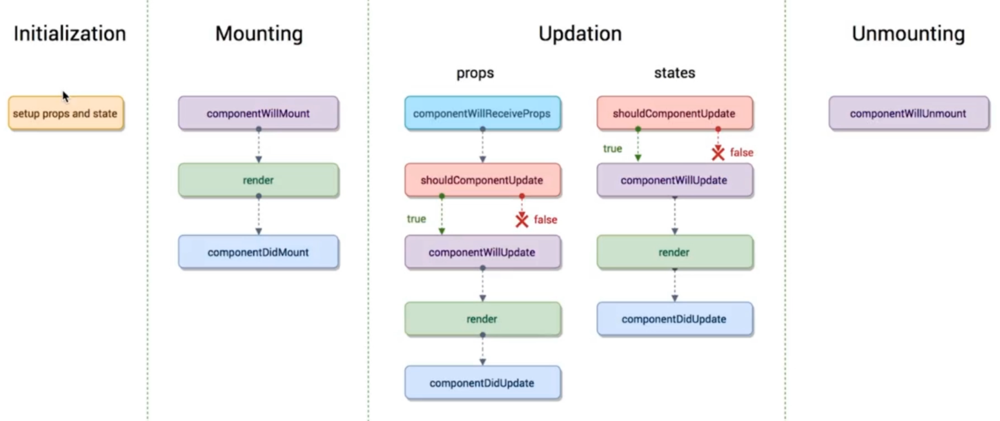
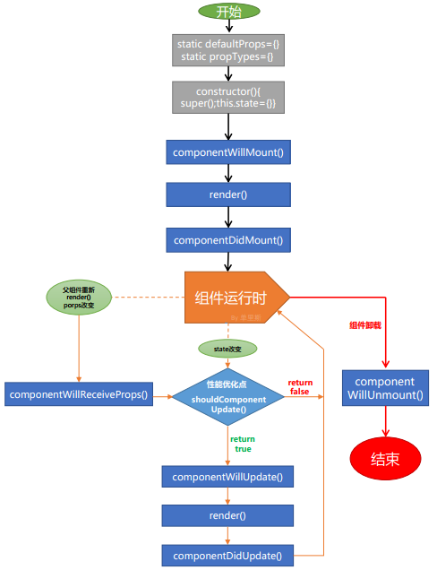
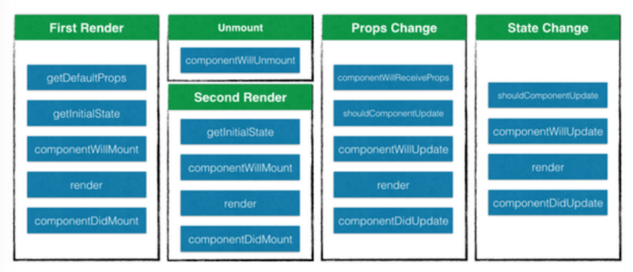

# React 生命周期

## 无状态（stateless）组件

```jsx
const MyButton = () => {
  return <h1>My Button</h1>
}
```

这种组件没有自己的独立状态，并且由于没有继承 `React.Component` 的缘故，所以获取组件的生命周期，也无法访问状态（state），但是依然能够传入属性（props），它们是作为函数的参数传入的。

## `<CustomeElement />` 代表什么？

这是 JSX 语法，本质上是 `React.createElement(MyButton, null)` 的语法糖，实际返回的是 `CustomeElement` 类型的 React 元素（element）。

React 元素本质上又是一个 Object 对象，这个对象由 **key(id)**、**props(属性)**、**ref**、**type(元素类型)** 四个属性组成。它代表的其实是虚拟 DOM（Virtual DOM）上的节点，是对你在页面上看到的每一个 DOM 节点的描述。

## 生成一个 React 元素后会触发生命周期吗？

```jsx
import MyButton from './Button';
class MyComponent extends React.Component {
  render() {
    const button = <MyButton />
    return <div>Hello World!</div>;
  }
};
```

上面的 `<MyButton />`，仅仅是被声明了，但是并不会被触发生命周期。真正的生命周期开始于组件被渲染至页面中。

## 出生阶段

### getDefaultProps & getInitialState

在 `constructor` 构造函数之后的周期函数并不是 `componentWillMount`，而是 `getDefaultProps` 和 `getInitialState`。
**getDefaultPops** 是对于组件类来说只调用一次。
**getInitialState** 是对于每个组件实例来讲都会调用，并且只调一次。

```jsx
var Hello = React.creatClass({
    getDefaultProps: function(){
        return { name: 'lbinin', git: 'LBinin' }
    },
    getInitialState: function() {
      return {liked: false};
  	  },
	  handleClick: function(event) {
      this.setState({liked: !this.state.liked});
    },
    render: function(){
		  var text = this.state.liked ? 'like' : 'haven\'t liked';
        return (
            <div>Hello,{this.props.name},git username is {this.props.git}</div>
			  <p onClick={this.handleClick}> You {text} this. Click to toggle. </p>
        )
    }
});
```

### componentWillMount(): void

> 特点：state 和 props 都已配置完毕，可通过 this.state 和 this.props 访问。且在 render 之前调用，**render 前修改 state 的最后一次机会，且不会触发二次 render**。

`componentWillMount` 函数在第一次 `render` 之前被调用，并且只会被调用**一次**。

当组件进入到这个生命周期中时，所有的 `state` 和 `props` 已经配置完毕，我们可以通过 `this.props` 和 `this.state` 访问它们，也可以通过 `setState` 重新设置状态。

由于该方法是在 render 函数之前调用，也是在 render 方法调用之前修改 state 的最后一次机会。之后的 render 函数可以看到更新后的 state，并且只会渲染一次。

👉🏻 推荐在这个生命周期函数里进行状态初始化的处理，可以进行开启定时器、向服务器发送请求等操作，为下一步 `render` 做准备。

### componentDidMount(): void

> 特点：此时页面中已有真正的 DOM 元素，可以进行相关 DOM 操作。

`componentDidMount` 在组件已经被渲染到页面中后触发，此时页面中有了真正的 DOM 的元素，可以进行 DOM 相关的操作。

此时不仅仅能够访问当前组件的 DOM，还能够访问当前组件**子组件**的原生 DOM 元素。这时候我们可以使用 `ref` 属性配合 `ReactDOM.findDOMNode(ref)` 访问到真实 DOM。

正是因为能够访问原生 DOM 的缘故，你可能会在 `componentDidMount` 函数中重新对元素的样式进行计算，调整然后生效。因此立即需要对 DOM 进行重新渲染，此时会使用到 `forceUpdate` 方法。[组件 API | React #forceUpdate](https://react-cn.github.io/react/docs/component-api.html#forceupdate)

👉🏻 正因为我们能在这个函数中访问原生 DOM，所以在这个函数中通常会做一些第三方类库初始化的工具，包括异步加载数据。

🌰 举个例子：

```jsx
import React from 'react';
import ReactDOM from 'react-dom';
import c3 from 'c3';
export default class Chart extends React.Component {
  componentDidMount() {
    this.chart = c3.generate({
      bindto: ReactDOM.findDOMNode(this.refs.chart),
      data: {
        columns: [
          ['data1', 30, 200, 100, 400, 150, 250],
          ['data2', 50, 20, 10, 40, 15, 25]
        ]
      }
    });
  }
  render() {
    return (<div ref="chart"></div>);
  }
}
```

## 更新阶段

接下来说说「更新阶段」~
先看看哪些场景会触发 React 的更新阶段：
- **父级组件更改了 props**
- **组件内部 state 发生变化**
- **调用 forceUpdate**（不推荐）

### componentWillReceiveProps(nextProps): void

> 特点：在该阶段可以获取到未发生改变的 props(this.props) 和发生了变化的 props(nextProps) 以进行对比，**在该阶段改变 state 不会触发二次渲染**。

当传递给组件的 props 发生变化的时候，`componentWillReceiveProps` 将会被调用。它的参数是发生改变后的 props（也就是 nextProps）。在该阶段中，我们依然能够通过 `this.props` 获取到未发生变化的 props。

若在该阶段调用 `setState()` 改变 state，是不会触发再一次的 render 的。

虽然 props 的更改会引起 componentWillReceiveProps 的调用，但 componentWillReceiveProps 的调用并不意味着 props 真的发生了变化。参考链接：[(A => B) !=> (B => A) – React Blog](https://reactjs.org/blog/2016/01/08/A-implies-B-does-not-imply-B-implies-A.html)

原因是旧的 props 和新 props 的实际上是相同的物理对象（只有对象的内部值发生了变化）。由于引用是全等的（===），所以进行相等检查并不会告诉我们值是否已更改。唯一可行的解​​决方案是创建数据的深层副本，然后进行深度比较；但对于大型数据结构（尤其是具有循环引用的数据结构），这可能会非常昂贵。
这样一来，React 无法知道 props 是否发生改变，这种情况下 React 会调用 `componentWillReceiveProps` 去检查 props 并采取相应的行动。

👉🏻 所以在这一阶段，我们可能需要对 props 做一个判断。

### shouldComponentUpdate(nextProps, nextState): boolean

> 特点：在该阶段可以获取到改变和未改变的 state 和 props，可**以控制生命周期是否继续**，是性能优化的关键点。

`shouldComponentUpdate` 决定了是否继续当前的生命周期。它非常重要，也是我们在写 React 性能优化转折点。

在该阶段，可以通过 `this.state` 和 `this.props` 获取到未发生改变的 state 和 props，可以通过参数 `nextProps` 和 `nextState` 获取到发生了变化的 state 和 props。

👉🏻 阶段内返回一个布尔值，返回 `true` 表示继续当前的生命周期，返回 `false` 表示终止当前的生命周期，也会阻止进一步的 render 与接下来的步骤。

### componentWillUpdate(nextProps, nextState): void

> 特点：和 componentWillMount 类似；此时可以获取到改变了和未改变的 state 和 props。

❗️`componentWillUpdate` 在这个阶段与 `componentWillMount` 不同的是，这个阶段需要注意 `setState` 的使用，没有条件的去 setState 将会触发另一轮的 render，导致无限渲染。

### componentDidUpdate(prevProps, prevState): void

> 特点：和 componentDidMount 类似，此时页面中最新的 DOM 元素已经渲染完成，**可以进行相关 DOM 操作**。

👉🏻 当组件进入 componentDidUpdate 阶段时意味着最新的原生 DOM 已经渲染完成并且可以通过 refs 进行访问。

和 componentDidMount 非常类似，子组件的 componentDidUpdate 会优先于父组件调用。

❗️在该阶段需要注意的是，如果在该阶段中修改了 state，并且默认情况下 `shouldComponentUpdate` 函数总是返回 **true** 的话，那么将会发生「无限 render」的情况。

所以如果你必须这么做，那么你应该把上一次的结果缓存起来，进行有条件的更新 state：

```jsx
componentDidUpdate(prevProps, prevState) {
  let height = ReactDOM.findDOMNode(this).offsetHeight;
  if (this.state.height !== height ) {
    this.setState({ internalHeight: height });
  }
}
```

## 死亡阶段

接下来说说「死亡阶段」

### componentWillUnmount(): void
当组件需要从DOM中移除时，即会触发 `componentWillUnmount` 钩子函数。

👉🏻 在这个函数中通常会做一些「清理」相关的工作，如：

- 将已经发送的网络请求都取消掉
- 移除组件上 DOM 的 Event Listener
- dispose 掉 mobx 的 reaction 等

## 顺序

- 首次被创建时：`constructor` -> `getDefaultProps` 与 `getInitialState` -> `componentWillMount` -> `render` -> `componentDidMount`。

- 当组件内存在子组件时的 `componentWillMount` 和 `render` 的调用顺序：先父组件及父组件同级组件，然后才是子组件，以此类推。因为当渲染父组件时，也需要立即开始渲染子组件，所以子组件的生命周期开始于父组件之后。

- 当组件内存在子组件时的 `componentDidMount` 的调用顺序：先子组件，然后才是父组件，以此类推。因为父组件想要渲染完毕，那么前提是它的子组件渲染完毕，也所以子组件的 `componentDidMount` 在父组件之前调用。

---

- 更新阶段：`componentWillReceiveProps` -> `shouldComponentUpdate` -> `componentWillUpdate` -> `render` -> `componentDidUpdate`

---

- 死亡阶段：`componentWillUnmount`

## 图解







## 参考资料

> [深入React的生命周期(上)：出生阶段(Mount) - 掘金](https://juejin.im/post/59fede45f265da430b7a9d9f)
> 
> [React：组件的生命周期 - 分享 - SegmentFault 思否](https://segmentfault.com/a/1190000004168886)
> 
> [图解ES6中的React生命周期 - 掘金](https://juejin.im/post/5a062fb551882535cd4a4ce3)
> 
> [React 组件生命周期 | 菜鸟教程](http://www.runoob.com/react/react-component-life-cycle.html)