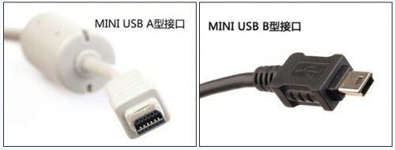
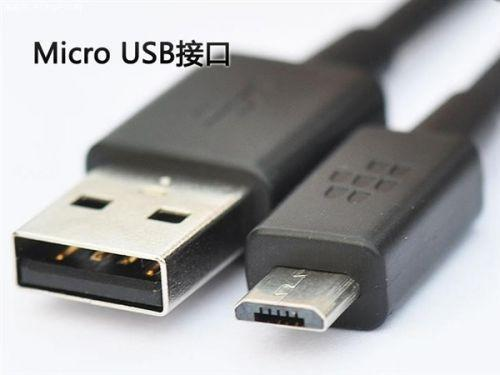
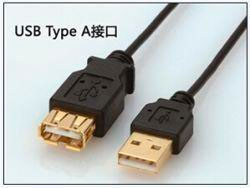
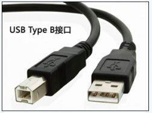
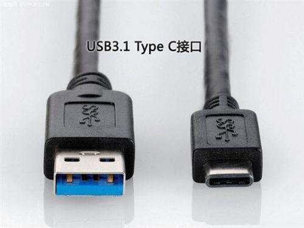

# USB 各版本区别及基本知识

## USB 简介

> USB（Universal Seiral Bus，通用串行总线）是连接计算机系统与外部设备的一种串口总线标准，也是一种输入输出接口的技术规范，被广泛地应用于个人计算机和移动设备等信息通讯产品，并扩展至摄影器材、数字电视（机顶盒）、游戏机等其它相关领域。

在 1994 年，Compaq，DEC，IBM，Intel，Microsoft，NEC 和 Nortel 七大公司，为了创造出一个统一且支持易插拔的外接式传输接口，来改善计算机刚问世后，许多各不相同的外设接口造成的繁杂而庞大的接口系统，开始了对「通用串行总线」的统一研发。

## 历史版本

在介绍各类不同类型的接头前先来介绍下 USB 的各大历史版本。

### USB 1.0
    
于 1996 年 1 月正式发布的。数据传输速率为 **1.5Mbps**（Low-Speed）。不过因为当时支持 USB 的周边装置少的可怜，所以主机板商不太把 USB Port 直接设计在主机板上。

### USB 1.1

修复了许多 1.0 版上发现的问题。最早被采用的修订版。数据传输速率为 **12Mbps**（Full-Speed）

### USB 2.0

> 传输速率增加到 480Mbps（实际 280Mbps）

于 2000 年 4 月发布。增加了数据传输速率，可达 **480Mbps**（现在称作 `Hi-Speed`），但受限于 [BOT 传输协议](#bot-传输协议)和 [NRZI 编码方式](#nrzi-编码)，实际最高传输速度只有 **280Mbps** 左右。

在 USB 2.0 中新增了许多最重要的规范，可在 [USB.org](http://www.usb.org/) 上查到：

<details>
<summary><strong>重要规范细节</strong></summary>

- Mini-A 和 Mini-B Connector ECN：2000 年 10 月发布。
- 规范 Mini-A 和 Mini-B 的插头及插座标准。注意不要与 Micro-B 插头及插座混淆。
- Errata as of December 2000：2000 年 12 月发布。
- Pull-up/Pull-down Resistors ECN：2002 年 5 月发布。
- Errata as of May 2002：2002 年 5 月发布。
- Interface Associations ECN：2003 年 5 月发布。
- 添加新的描述符以便将多重接口关联在在单一设备功能中。
- Rounded Chamfer ECN：2003 年 10 月发布。
- 一项针对 Mini-B 接口坚固性的建议性、兼容性改进。
- Unicode ECN：2005 年 2 月发布。
- 这项 ECN 指定了字符串可以使用 UTF-16LE 编码。USB 2.0 曾指定可以使用 Unicode，但没有指定编码。
- Inter-Chip USB Supplement：2006 年 3 月发布。
- On-The-Go Supplement 1.3：2006 年 12 月发布。
- USB 直连（USB On-The-Go）允许两个 USb 设备不经独立 USB 主机端直接相互通讯。实际使用中，是其中一个 USB 设备作为其它设备的主机端。
- Battery Charging Specification 1.0：2007 年 3 月发布。
- 添加对充电器（有 USB 接口的电源适配器）的支持，当供电端（作为充电器的 USB 主端口）和电池连接时，它允许瞬间通过 100 mA 的电流。如果一个 USB 设备连接到专用充电器或主端口时，最大瞬间电流可达 1.5 A。（该文档并未包含在 USB 2.0 规范中。）
- Micro-USB Cables and Connectors Specification 1.01：2007 年 4 月发布。
- Link Power Management Addendum ECN：2007 年 7 月释出。
- 在启用与待机间增加新的电源模式。当设备处于这个模式时不向其发送指令以减少电源消耗。所以，在启用及睡眠模式间切换要比在启用及待机模式间切换快得多。
- High-Speed Inter-Chip USB Electrical Specification Revision 1.0：2007 年 9 月发布。

</details>

### USB 3.0

> 采用全双工数据传输，传输速率飙升至 5Gbps，并向下兼容

于 2008 年 11 月发布，速度由 `480Mbps` 大幅提升到 **5Gbps**。

从 USB 3.0 开始，插座通常是蓝色的，**并向下兼容 USB 2.0**。

USB3.0 引入「全双工数据传输」。5 根线路中 2 根用来**发送数据**，另 2 根用来**接收数据**，还有 1 根是地线。也就是说，USB 3.0 可以**同步全速地进行读写操作**。

USB 3.0 的设计在 USB 2.0 的基础上新增了两组数据总线，而为了保证向下兼容，USB 3.0 保留了 USB 2.0 的一组传输总线。在传输协议方面，USB 3.0 除了支持传统的 **BOT 协议**，还新增了 [UASP 协议](#uasp-传输协议)，可以完全发挥出 5Gbps 的高速带宽优势。

### USB 3.1

> 这个版本起，供电能力大幅提高

USB 3.0 推广小组于 2013 年 7 月 31 日宣布 USB 3.1 规格，传输速度提升为 **10Gbps**，比 USB3.0 的 `5Gb/s` 快上一倍，并向下兼容 USB 2.0/1.0。

如果要得到 10Gb/s 的传输速度仍需在主机、目标端同时具备对应的芯片才能达成，电力供应可高达 **100 瓦**。

### USB 3.2

> 双通道 10Gbps

USB 3.2 的主要技术要点：

1. 在现有的 USB Type-C 数据在线实现「双通道」
2. 继续使用现有的超高速 USB 物理传输率和技术
3. 一些小的规范更新，确保**单双通道无缝切换**。

速度方面，使用 USB 3.2 主机连接 USB 3.2 存储设备，可以实现两条通道 **10Gbps** 的传输速度，也就是超过 **2.5GB/s**。

据悉，USB 3.2 因为要求集成 USB 2.0 和 USB 3.1 主控，所以完全向下兼容。

另外，从 USB 3.2 开始，Type-C 将成为唯一推荐的接口方案。

## 各类型 USB

### Mini-USB



**Mini-USB** 一般用于数码相机、数码摄像机、测量仪器以及移动硬盘等移动设备。

很多老式的 Android 手机或者平板都是使用的 Mini-USB type B（上图右）

### Micro-USB



**Micro-USB** 是 USB 2.0 标准的一个**便携版本**，也是 **Mini USB** 的第二代规格，很长一段时间，各大 Android 手机厂商使用的都是 **Micro-USB** 接口

### USB Type A



**USB-A** 是一款至今使用还非常广泛的接口，在笔记本、主机上都能见到。

虽然 USB-A 的公母接口相同，但是由于一些民间传说「正反设计的相同是为了增加使用寿命，不让你一次性就能插入」，让我们感同身受其设计之难受 😭，好在 Type-C 正在一步步普及。

### USB Type B



**USB-B** 主要用于数据的「上传」，一般在可移动的设备「但又不那么容易移动」上用到，比如显示器、打印机，扫描仪等。

### USB Type C



**USB Type C** 这个接口名称是在 USB 3.1 时代之后出现的，该接口的亮点在于**更加纤薄的设计**、**更快的传输速度**（最高 10Gbps）以及**更强悍的电力传输**（最高 100W）。见 [USB 3.1](#usb-3-1)。

虽然 Type-C 和 USB 3.1 经常一起出现，但也不是所有的厂商的 Type-c 接口都是 USB 3.1 标准的，也有许多厂商（如一加、乐视）使用的 Type-C 还是 USB 2.0 标准。所以在购买相关设备之前请看清楚其标准哦。

Type-C 最大的特点是：**支持 USB 接口双面插入**，主要面向更轻薄更纤细的设备（未来可能统一手机平板甚至电脑的接口，取代 Micro USB 接口，如今 2017 款 MacBook 已经开始使用 Type-C 作为电源接口了）。

**Type-C 特点一览**：

1. 最大数据传输速度达到 `10Gbps`，也是 USB 3.1 的标准;

2. Type-C 接口插座端的尺寸约为 `8.3mm×2.5mm` 纤薄设计;

3. 支持从正反两面均可插入的「正反插」功能，可承受 **1 万次反复插拔**;

4. 配备 Type-C 连接器的标准规格连接线可通过 `3A` 电流，同时还支持超出现有 USB 供电能力的 **USB PD**（USB Power Deliver），可以提供最大 `100W` 的电力。所以你能用一根 Type-C 数据线同时为显示器 + Macbook 供电。

## 扩展知识

### BOT 传输协议

Bulk-Only Transport，诞生于 1999 年，专为 USB 1.1 所设计，至今最快的 USB 3.2 都可向下兼容这个基本的 BOT 传输协议。

BOT 传输协议属于「**半双工传输模式**」，即在传输数据作业开始时，外接 USB 3.0 设备与计算机主板（USB 3.0 扩展卡）之间，在同一时间单位内，**每次只传输单一指令**，所以速度较 [UASP](#uasp-传输协议) 慢。

### NRZI 编码

NRZI（Non return to zero, inverted）翻转不归零制。

NRZI 的发送信号有两种准位，并且在准位信号内也已经夹带了同步时脉信号于内，`1` 表示**电位不变时**的传送逻辑，`0` 表示**电位翻转时**的传送逻辑。（遇 0 翻转，遇 1 不变）

举个例子：一个资料串流包含的位元依序为 `10110010`，假设初始状态为 `H`（一个高位电平信号）。这个比特流就会通过 NRZI 编码转化成 `LLHLLLHH`

也就是：

```
  1 0 1 1 0 0 1 0
  0 1 0 0 1 1 0 1 # 反转，因为从最后一位开始读
  ↓ ↓ ↓ ↓ ↓ ↓ ↓ ↓
H L L H L L L H H
```

详见：[NRZI编码 - 会飞的石头 - CSDN博客](https://blog.csdn.net/ppdyhappy/article/details/50687352)

### UASP 传输协议

**USAP**（USB Attached SCSI Protocol）是 **USB-IF**（USB Implementers Forum，一些为开发 USB 规格的企业共同成立的一个非营利性机构）为了**改良「半双工的 BOT 传输协议」过慢的缺点**，将 [SCSI](https://zh.wikipedia.org/wiki/%E5%B0%8F%E5%9E%8B%E8%AE%A1%E7%AE%97%E6%9C%BA%E7%B3%BB%E7%BB%9F%E6%8E%A5%E5%8F%A3) 架构改进，所制定的一个新传输协议，与 USB 3.0 一同诞生于 2008 年，让 USB3.0 也能像 SCSI 传输协定的方式传输资料，不需等待上一笔资料传输完成后再进行传输资料的动作。（**USAP 属于全双工模式**）

该协议用于透过 USB 接口连接序列设备，提供大容量储存设备的传输速度高达 20％，并降低 CPU 的利用率、数据延迟和等待时间，USAP 协议提供了高性能主机及设备之间的数据传输。

启动 UASP 虽然能提升传输性能，但也有许多限制，计算机用户必须具备支持 UASP 的「外接 USB 3.0 设备内部」的**设备端控制器**、**主板上的主机端控制器**、**驱动程序**，三者缺一不可（有的还额外需要安装驱动）。

在 OS 支持度上，使用 Windows 7 的用户若想启动 UASP，必须安装相应的驱动程序，如果用户使用 Windows 8/Mac OS X 10.8.3 以及之后的版本，因为其已内置 UASP 的驱动程序，所以直接原生支持 UASP，如此可省去安装驱动程序的麻烦。

## 参考资料

> [USB - 维基百科，自由的百科全书](https://zh.wikipedia.org/wiki/USB)
> 
> [USB-A、USB-B 與 USB-C 分別到底在那裡？一篇給你看過明白 | TechRitual - 香港 No.2 電腦資訊網站](https://www.techritual.com/2018/06/21/134405/)
> 
> [USB Type A/B/C基本知识和各版本区别 - 软件无忧](https://www.kafan.cn/edu/88896614.html)
> 
> [每次节省 1 小时！学会这招快充大法，让你的 iPhone 充电快到飞起](https://mp.weixin.qq.com/s/Gg9VraaQH79T_RX9rG-Lqg)
> 
> [USB 2.0传输协议介绍：不能并行的BOT_USB开发中国](http://www.usbing.com/protocol/7124.html)
> 
> [UASP 是什么？支持 UASP 的 USB 3.0 有什么用？- 电脑知识 - U 盘量产网](http://www.upantool.com/sense/2015/7822.html)
> 
> [单工,半双工,全双工区别以及TDD和FDD区别 - 好记性不如烂笔头的专栏 - CSDN博客](https://blog.csdn.net/starstar1992/article/details/53032409)