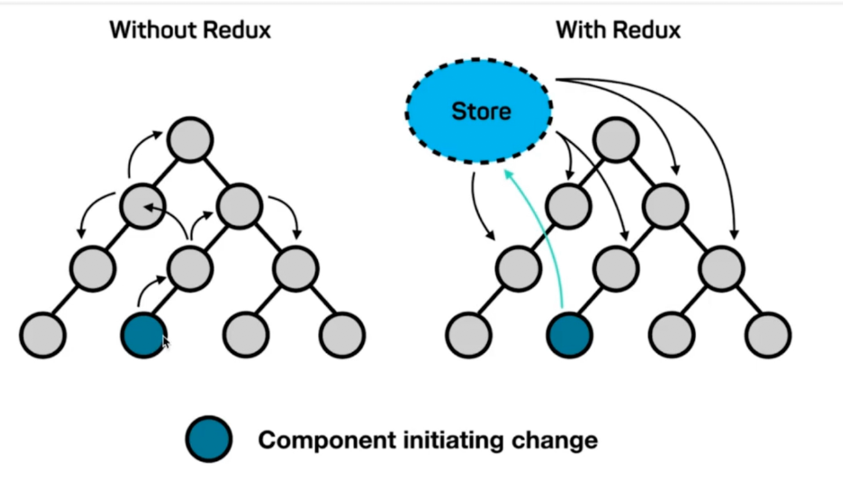
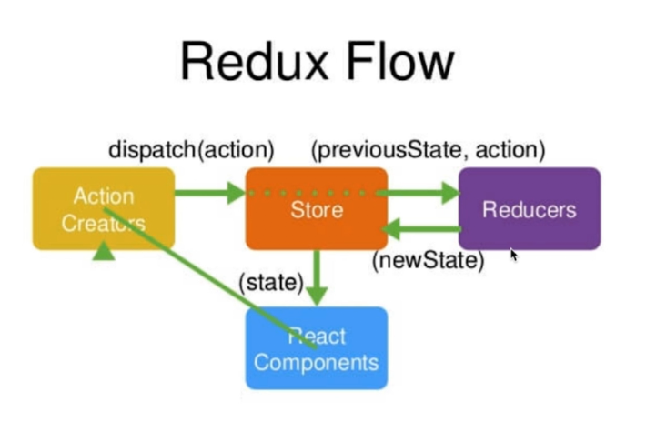
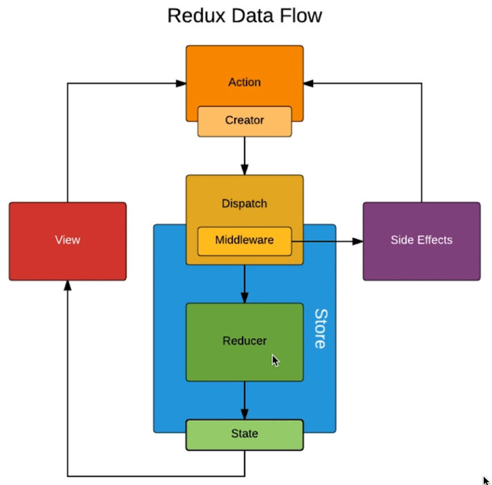

## 项目总结

React 16.x 称之为 「React Fiber」，React 底层在事件循环中加入优先级的概念，可以利用时间循环的碎片时间执行一些高优先级的用户交互，提高 React 在使用过程中的用户体验。（React 16: https://www.jianshu.com/p/af0ae26eac18）

相对 Vue.js 灵活性更大一些，在处理一些非常复杂的业务时，技术方案有更多的选择。而 Vue.js 提供了更丰富的 API，实现功能会更简单，正是因为 API 丰富，在开发过程中，灵活性就有一定的限制。对于复杂度较高的项目，更倾向于 React.js；而在做一些面向用户端，复杂度不是特别的高的项目时，用 Vue.js 会更爽一些。（当然 Vue.js 也能做复杂的项目）

### Create-react-app

### manifest.json


### registerServiceWorker

用于 PWA

### import { Fragment } from React

占位符，用于包裹其他元素以供 `return`。

### React 中的响应式设计思想和事件绑定

不要直接操作 DOM，我们需要操作数据，通过数据的变化，React 自动生成、更新 

immutable!!! state 不允许我们做任何的改变，否则 React 性能优化会出现问题。

### JSX 细节

`dangerouslySetInnerHTML=\{\{__html: 'xx'\}\}`

`<label>` 中的 `for` 属性，改成 `htmlFor`

### 父子组件

子组件想要修改父组件的内容，只能用父组件的通过 `props` 提供给子组件的方法，子组件去调用方法，去修改父组件的内容。

父组件只需要给子组件传 props。

### React 16 推荐

`setState` 推荐使用函数返回一个对象，而不是直接传入一个对象。且可在函数中接受一个对象 `prevState`，这个对象相当于 `this.state`，可以避免你修改 `state` 的状态。

```js
this.setState((prevState) => ({
  list: [...prevState.list, prevState.inputValue],
  inputValue: ''
}))
```

### 不推荐 key 用 index

因为index **不稳定**。在 Diff 算法中，可能无法判断前后「虚拟 DOM」对应关系。

如：现在有 `{a: 0, b: 1, c: 2}`，键名为元素，键值为 key 值，这时候如果删除了 `a`，由于采用的 index 作为 key，此时 `b` 的 key 值为 `0`，React 无法建立前后对应关系

### 声明式开发和命令式开发

命令式：直接操作 DOM，告诉 DOM 要做什么事。

声明式：有了数据后，让 React 去操作 DOM。

### 与其他框架并存

```jsx
ReactDOM.render(<TodoList />, document.getElementById('root'));
```

说明 React 只操作 `#root` 元素。其他框架也同理。

### 单项数据流

主要思想是组件不会改变接收的数据。也就是说父组件可以向子组件传值，但是子组件不能改变父组件的值。

如果需要，可以在父组件将修改数据的方法，传递给子组件，让子组件调用。

详细阅读：[单向数据流 · React 模式](http://sangka-z.com/react-in-patterns-cn/chapter-7/)

### PropTypes 与 DefaultProps

PropTypes：接受的 `props` 类型强校验。

DefaultProps：对应 `props` 要是值为空，则使用 DefaultProps 中对应的值。

```jsx
import PropTypes from 'prop-types';

TodoItem.propTypes = {
  content: PropTypes.string.isRequired,
  index: optionalArrayOf: PropTypes.oneOfType([PropTypes.number, PropTypes.string]),
  onDelete: PropTypes.func,
};

TodoItem.defaultProps = {
  content: 'default Value'
};

export default TodoItem;
```

https://reactjs.org/docs/typechecking-with-proptypes.html

### Props，State 与 Render 函数

为什么数据一旦发生变化，页面就会重新渲染呢？

因为当组件的 state 或者 props 发生改变的时候，render 函数就会重新执行。

当父组件的 render 函数被运行时，它的子组件的 render 都会被重新执行。

### 虚拟 DOM

虚拟 DOM 就是一个 JS 对象，用它来描述真实 DOM。

```jsx
<div id="dom">
  <span>Hello World</span>
</div>

// 可以用如下数组表示
// 每个数组表示一个 DOM 对象
// 第一个元素表示 DOM 的 tag 名称
// 第二个元素表示 DOM 上的属性
// 第三个元素表示其「子元素」
[
  'div',
  {id: "dom"},
  [
    'span',
    {},
    'Hello World'
  ]
]
```

#### 替换数据步骤：

1. 接收 state、props 数据；
2. 准备 JSX 模板；
3. 数据 + JSX，结合生成虚拟 DOM（本质上一个 JS 对象 `['div', {id: 'dom'}, ['span', {}, 'Hello']]`）。**在这里损耗了性能**；
4. 根据虚拟 DOM 的结构，生成并显示真实的 DOM（`<div id="dom"><span>Hello</span></div>`）；
5. state 发生变化，`Hello -> Bye`；
6. 数据 + 模板，结合生成新的虚拟 DOM `['div', {id: 'dom'}, ['span', {}, 'Bye']]`。**这里极大的提升了性能**；
7. 比较新老虚拟 DOM 之间的差异（比 DOM 对比效率高），找到区别是 `span` 的子元素发生了变化。**这里极大的提升了性能**；
8. 直接操作 DOM，替换 `<span>` 标签中的内容。

#### 虚拟 DOM 优点：

1. 性能提升

    减少了「真实 DOM」的创建和对比，取而代之的都是 JS 对象的创建和对比。性能的提升都是因为 JS 对象的创建和对比，比「真实 DOM」的创建和对比效率要高。

2. 它是的跨端应用得以实现。（如：React Native）

#### JSX -> JS 对象 -> 真实 DOM

```jsx
<div><span>this is a string</span></div>
// 相当于
React.createElement('div', {}, React.createElement('span', {}, 'this is a string'));
```

也就是说，JSX 语法会被用 `React.createElement` 方法创建为一个「虚拟 DOM」也就是 JS 对象，然后 React 根据这个虚拟 DOM，去生成「真实 DOM」。

#### 虚拟 DOM 中的 Diff 算法

也就是上面文字步骤的第 7 步：比较新老虚拟 DOM 之间的差异。

归根到底，更新的原因是因为 `setState` 修改了 `state` 了。

`setState` 方法是异步的，是用于提升 React 性能。因为：如果连续三次 `setState`，React 会将三次 `setState` 合并称为一个 `setState`，从而只需要做**一次**的「虚拟 DOM」的比对，只需要更新**一次**「真实 DOM」。

实质上 Diff 为了提升性能，进行的是「同层比对」。

React 中即比较两个虚拟 DOM 节点，当两个节点不同时，应该分为三种情况：

1. 节点类型不同 

    当前后 DOM 节点类型不同的时候，React 将直接删除前面的节点，然后创建并插入新的节点。删除节点意味着彻底销毁该节点，而不是再后续的比较中再去看是否有另外一个节点等同于该删除的节点。如果该删除的节点之下有子节点，那么这些子节点也会被完全删除，它们也不会用于后面的比较。这也是算法复杂能够降低到 O(n) 的原因。
    所以，当 React 在同一个位置遇到不同的组件时，也是简单的销毁第一个组件，而把新创建的组件加上去。

    对于同一层的节点，React 只会简单的考虑节点的位置变换，对于不同层的节点，只有简单的创建和删除。
    所以在实现自己的组件时，保持「稳定」的 DOM 结构会有助于性能的提升。例如：我们有时可以通过CSS隐藏或显示某些节点，而不是真的移除或添加 DOM 节点。
    [React Virtual DOM Diff](https://supnate.github.io/react-dom-diff/index.html)

2. 节点类型相同，但是属性不同。本节先看第一种情况。

    对于这类节点的比较就相对简单，React 将会对属性进行重设从而实现节点的转换。

3. 列表节点的比较

    如果列表中的每个节点都没有唯一的标识（key），那么 React 将无法识别每一个节点，导致更新过程十分低效。如在列表的某个位置插入一个节点，有 key 的情况下，React 能够找到位置并插入，其他同级节点不做更新；如果没有 key，React 将会一个个更新，然后再在最后插入最后的节点（不管这些节点是否需要更新）。

    所以， key 属性可以帮助 React 定位到正确的节点进行比较，从而大幅减少 DOM 操作次数，提高了性能。

### Ref

在 React 16 中，推荐 ref 使用一个函数来接收 `ref`，这个 `ref` 就是真实的 DOM 节点。

```js
<input ref={(input) => {this.inputRef = input}}>
```

不推荐使用 `ref`，除非必须用到（如：动画），因为我们要「数据驱动」

### 生命周期

生命周期是在某一特定时刻组件会被自动调用执行的函数。

### AJAX 请求放置位置

尽量放在 `componentDidMount` 去请求数据

### 使用 Charles Mock 数据

Tool -> Map Local -> Enable Map Local -> add

配置如下：

```js
{
  Protocol: 'http',
  Host: 'localhost',
  Port: 3000,
  Path: '/api/***',
}

// Map to
{
  'Local path': '选择文件即可'
}
```

### react-transition-group

React 第三方动画模块：https://reactcommunity.org/react-transition-group/

此外还提供了

- Transition
- CSSTransition
- TransitionGroup

```bash
$ yarn add react-transition-group
```

```jsx
import {CSSTransition, TransitionGroup} from 'react-transition-group';

/* http://reactcommunity.org/react-transition-group/css-transition/ */
<CSSTransition
  in={this.state.show}
  timeout={1000}
  classNames="show"
  unmountOnExit /* 动画结束后移除 DOM */
  onEntered={(e) => { e.style.color = "blue"; console.log(e); }}
  appear={true}
>
  <div>Hello</div>
</CSSTransition>


// TransitionGroup 配合 CSSTransition 让多个元素进行动画效果
<TransitionGroup>
  {
    this.state.list.map((item, index) => {
      return (
        <CSSTransition
          key={index}
          in={this.state.show}
          timeout={1000}
          classNames="show"
          unmountOnExit /* 动画结束后移除 DOM */
          onEntered={(e) => {
            e.style.color = 'blue';
            console.log(e);
          }}
          appear={true}
        >
          <div>{item}</div>
        </CSSTransition>
      )
    })
  }
</TransitionGroup>
```

类似 Vue 中的 `<transition>`、`<transition-group>`

### Redux

React 仅仅只是一个视图层的框架。并没有数据层，所以数据传递非常麻烦。

设计理念：


Redux = Reducer + Flux

工作流程：


**React Components**: 借书人

**Action Creators**: 想要借书的信息（改变或读取数据）

**Store**: 图书馆管理员

**Reducers**: 图书信息系统（找书）

- 安装：

    ```bash
    $ yarn add redux
    ```

- 创建 store 和 reducer：

    在 `/src` 目录下新建 `/store` 目录，新建 `index.js` 和 `reducer.js` 两个文件：

    ```js
    // store/index.js
    import { createStore }  from 'redux';
    import reducer from './reducer';

    const store = createStore(reducer); // 创建 store 的时候需要传入 reducer，这个 reducer 就是一个函数，接收 state 和 action
    export default store;


    // store/reducer.js
    const defaultState = { // 默认数据
      inputValue: '',
      list: []
    };

    export default (state = defaultState, action) => {
      // state: 上次 store 中所有数据的集合
      // action: 通过 store.dispatch(), store 传给 reducer 的 action
      return state;
    }
    ```

- 获取 store 中的 state，使用 `getState()` 方法：

    ```js
    // app.js
    import React, { Component } from 'react';
    import store from './store';

    class xxx extends Component {
      constructor(props) {
        super(props);

        this.state = store.getState();
        // 这时候 state 就是 store 中的 state 了
      }
    }
    ```

- 修改 store 中的 state，使用 `dispatch()` 方法：

    ```js
    import store from './store'
    // ...

    // 创建一个 action
    const action = {
      type: 'change_input_value', // 相当于 action 的名字
      value: 'this is a new value'
    }

    store.dispatch(action)
    ```

    然后在 reducer 中将会接收到一个 action，在 reducer 中去处理：

    ```js
    // reducer.js
    export default (state = defaultState, action) => {
      if (action.type === 'change_input_value') {
        const newState = JSON.parse(JSON.stringify(state));
        newState.inputValue = action.value;
        return newState; // 这里的 newState 将会返回给 store, store 会将接收到的数据「替换掉」store 中老的 state
      }

      return state;
    }
    ```

- 修改完 store 中的 state，组件也需要进行监听和更新，使用 `subscribe()` 方法去监听 state 的变化：

    ```js
    // app.js
    class xxx extends Component {
      constructor(props) {
        super(props);

        this.handleStoreChange = this.handleStoreChange.bind(this)

        store.subscribe(this.handleStoreChange);
      }

      handleStoreChange() {
        console.log('store had changed')
        this.setState(store.getState()); // 将 store 中的 state 取出，去替换当前组件的 state
      }
    }
    ```

    传入 `subscribe()` 方法的函数将会在 store 中 state 发生变化的时候去调用。

- 使用 actionTypes 拆分所有 active.type

    在 `/store` 目录下新建 `actionTypes.js` 用来管理所有 action.type

    ```js
    // actionTypes.js
    export const CHANGE_INPUT_VALUE = 'change_input_value';
    export const ADD_TODO_ITEM = 'add_todo_item';
    export const DELETE_TODO_ITEM = 'delete_todo_item';
    ```

    然后可以在 reducer 中去 `import` 这个文件，然后用对应的变量去替换之前的字符串：

    ```js
    import { CHANGE_INPUT_VALUE, ADD_TODO_ITEM, DELETE_TODO_ITEM } from './actionTypes';

    // ...
    export default (state, action) => {
      if (action.type === CHANGE_INPUT_VALUE) {
        // ...
      }
    }
    ```

- 使用 actionCreator 同一创建 action

    在 `/store` 文件夹下新建 `actionCreator.js` 文件：

    ```js
    import {ADD_TODO_ITEM, CHANGE_INPUT_VALUE, DELETE_TODO_ITEM} from './actionTypes';

    export const getInputChangeAction = (value) => ({
      type: CHANGE_INPUT_VALUE,
      value
    });

    export const addTodoItem = () => ({
      type: ADD_TODO_ITEM,
    });

    export const deleteTodoItem = (index) => ({
      type: DELETE_TODO_ITEM,
      index
    });
    ```

    然后在组件中去替换原本手写的 action 对象：

    ```js
    const value = e.target.value;

    const action {
      type: CHANGE_INPUT_VALUE,
      value
    };
    // 将上面的对象字面量替换为

    const action = getInputChangeAction(value);

    store.dispatch(action)
    ```

    这样一来，组件中也不需要去引入 `actionTypes` 文件以及自己声明一个对象字面量，让 `ac†ionCreator` 去同一创建 action。

#### Redux 设计和使用的三大原则

- **store 是唯一的**

    也就是 `/store/index.js` 下，用 `createStore()` 方法创建的。

- **只有 store 能够改变自己的内容**

    reducer 拿到原本的数据，返回一个新的 state，store 拿到这个新的 state 去替换原本老的数据。reducer 中并不修改 state。
    
    （所以用的 `JSON.parse(JSON.stringify(state))` 去深复制一个 state，并没有直接修改函数接收 `state`）

- **Reducer 必须是个纯函数**

    纯函数：给定固定的输入，就一定会有固定的输出，而且不会有任何副作用

    固定：也就是 state 和 action 是固定的，返回的 newState 就是固定的。（如果包含返回的 `newState` 了如：`new Date()`，就不是纯函数）

    副作用：如修改了接收的参数 `state` 中的内容。

#### 总结

四大函数

- `createStore(reducer)` 创建 store
- `store.dispatch(action)` 派发事件
- `store.getState()` 获取 store 中的数据
- `store.subscribe(func)` 当 store 中的数据发生了变化，那么通过 `subscribe()` 方法传入的函数就会被调用。

### UI 组件和容器组件

UI 组件：负责渲染

容器组件：负责逻辑

容器组件把所有数据、方法，通过 props 传递给 UI 组件，完全不管 UI 界面。

UI 组件负责接收和使用数据、方法即可，不需要管理数据的逻辑。

### 在 props 传递一个函数

如果这个函数需要接收参数，不能直接写

```jsx
<button onClick={this.handleItemDelete(index)}>删除</button>
```

而是要写成

```jsx
<button onClick={() => {this.handleItemDelete(index)}}>删除</button>
```

因为 `onClick` 需要的是一个函数 `onClick={this.handleItemDelete}` 是可以的，因为 `this.handleItemDelete` 就是一个函数，然鹅，`this.handleItemDelete(index)` 并不是一个函数而是这个函数的返回值，除非他的返回值是一个函数，否则就会报错。

### 无状态组件

当一个组件只用到了 `render` 函数，那么这个组件就可以写成「无状态组件」。

所谓的「无状态组件」，就是一个函数，这个函数接收 `props`，然后 `return` 一个 JSX。

https://juejin.im/entry/59a980306fb9a02485103d0b

优点：

- 比起有状态组件性能要高，因为没有生命周期和状态。
- 代码简介，可读性高
- 没有 this（由于使用剪头函数）

### Redux thunk 中间件

> Redux thunk 可以把异步请求、复杂逻辑放到 action 去处理

- 安装

    ```bash
    $ yarn add redux-thunk
    ```

- 配置

    在 `/store/index.js` 中添加如下中间件配置：

    ```js
    import { createStore, applyMiddleware } from 'redux';
    import thunk from 'redux-thunk';
    import reducer from './reducers';

    // Note: this API requires redux@>=3.1.0
    const store = createStore(
      reducer,
      applyMiddleware(thunk)
    );
    ```

    如果有 `redux-dev-tools`，需要额外配置：

    ```js
    import {createStore, applyMiddleware, compose} from 'redux';
    import thunk from 'redux-thunk';
    import reducer from './reducer';

    const composeEnhancers = window.__REDUX_DEVTOOLS_EXTENSION_COMPOSE__ ? window.__REDUX_DEVTOOLS_EXTENSION_COMPOSE__({
        }) : compose;

    const enhancer = composeEnhancers(
      applyMiddleware(thunk),
    );

    /* eslint-disable no-underscore-dangle */
    const store = createStore(
      reducer,
      enhancer,
    );
    /* eslint-enable */

    export default store;
    ```

    然后在 `actionCreator.js` 中，去创建一个 action，返回的这个 action 不再是一个对象，而是一个**函数**：

    需要注意的是：

    - 这个函数接收一个参数 `dispatch`，也就是 store 的 `dispatch()` 方法（不需要引入 store）
    - 正是因为我们使用了 `redux-thunk` 这个中间件，才能让我们的 action（被 `dispatch` 的 action）作为一个**函数**，否则，将会报错：`action 必须是一个对象`
    - 引入 `redux-thunk` 后，如果 redux 发现 action 是一个函数，这个函数就会被执行，然后传入 `dispatch` 方法作为参数。

    ```js
    export const getTodoList = () => {
      return (dispatch) => {
        axios
        .get('/list.json')
        .then((res) => {
          // 处理异步获取的数据
          // 也可以在这里去 dispatch 其他 action
          const action = initListAction(res.data);
          dispatch(action);
        }).catch((e) => {
          console.log(e.message);
        })
      }
    };
    ```

    使用的话和正常的 action 一样使用：

    ```js
    import {getTodoList} from './store/actionCreator';
    // ...

    const action = getTodoList(); // 这时候 action 就是一个函数
    store.dispatch(action); // 然后 dispatch 这个函数，函数就会被执行
    ```

### Redux 中间件

Redux 数据流



1. View 派发 action
2. action 通过 `dispatch()` 方法给派发给 store
3. store 接收到 action 后，连同 `state` 一起传递给 reducer
4. reducer 返回新的数据给 store
5. store 接收到新的数据后，替换掉老的数据（自己的 state）

Redux 的中间件的「中间」指得是 `action` 和 `store` 的中间

`action` 通过 `dispatch()`，给 store，所以 redux-thunk 就是对 `dispatch` 方法进行了**扩展**，让其支持接收一个**函数类型**的 `action`。

### Redux-saga

> 也是一个做异步代码拆分的中间件。

https://github.com/redux-saga/redux-saga

异步代码处理一般用 redux-saga 或者 redux-thunk

- 安装

    ```bash
    $ yarn add redux-saga
    ```

- 配置

    ```js
    import {createStore, applyMiddleware, compose} from 'redux';
    import reducer from './reducer';
    import createSagaMiddleware from 'redux-saga'; // 引入中间件
    import TodoSagas from './sagas';

    const sagaMiddleware = createSagaMiddleware(); // 创建一个 saga 中间件

    const composeEnhancers = window.__REDUX_DEVTOOLS_EXTENSION_COMPOSE__ ? window.__REDUX_DEVTOOLS_EXTENSION_COMPOSE__({
        }) : compose;

    const enhancer = composeEnhancers(
      applyMiddleware(sagaMiddleware), // 应用 saga 中间件
    );

    /* eslint-disable no-underscore-dangle */
    const store = createStore(
      reducer,
      enhancer,
    );

    sagaMiddleware.run(TodoSagas); // 用我们的 sagas.js 去运行 saga 中间件
    /* eslint-enable */

    export default store;
    ```

    在 `/store` 文件夹下创建一个 `todoSagas.js` 文件，接下来的精力都会放在这个文件中：

    ```js
    import {takeEvery, put} from 'redux-saga/effects';
    import {GET_INIT_LIST} from './actionTypes';
    import {initListAction} from './actionCreator';
    import axios from 'axios';

    // 对应的 action 的回调函数，最好也是一个生成器函数
    function* getInitList() {
      try {
        const res = yield axios.get('/list.json');
        const action = initListAction(res.data);
        yield put(action); // 使用 put
      } catch (e) {
        console.log('list.json 请求失败')
      }
    }

    // 这是一个默认的生成器函数，saga 要求默认的 export 的函数必须是生成器
    function* todoSagas() {
      yield takeEvery(GET_INIT_LIST, getInitList); // 一旦接收到对应的 type 的 action，就会执行相应的回调函数
    }

    export default todoSagas;
    ```

数据流程：

1. 组件派发 action
2. 通过 redux-saga 上面的配置，让 `sagas.js` 文件能够接收到这个 action
3. 在默认 export 的方法中用 `takeEvery` 方法去监听你需要的 action.type，执行对应的回调函数。

相比 Redux-thunk，Redux-saga 的 API 更加丰富，适合大型复杂的项目。

### React-redux

- 安装

    ```bash
    $ yarn add react-redux
    ```

- 配置

    在 `index.js` 入口文件中配置：

    ```js
    // index.js
    import React from 'react';
    import ReactDOM from 'react-dom';
    import TodoList from './TodoList';

    // 引入 react-reduc
    import { Provider } from 'react-redux'; // 使用其中一个 API，`Provider` 提供器
    import store from './store'; // 引入 store

    // 定义一个 JSX，设置 Provider 的 props
    // 之后 Provider 下面「所有的组件」都可以获取到 store 中的内容
    const App = (
      <Provider store={store}>
        <TodoList />
      </Provider>
    );

    // 去 render 用 `Provider` 包裹的 App
    ReactDOM.render(App, document.getElementById('root'));
    ```

    在 `TodoList.js` 中配置：

    ```jsx
    import React, { Component } from 'react';
    import { connect } from 'react-redux';

    class TodoList extends Component {
      render() {
        return (
          <div>
            <input
              value={this.props.inputValue}
              onChange={this.props.changeInputValue}
            />
          </div>
        )
      }
    }
    
    // 把 store 中的 state 映射到连接的组件的 props
    const mapStateToProps = (state) => {
      // state 是 store 中的数据
      // 返回一个对象，就是该组件接收到的 props
      // 也就是组件可以通过 `this.props[key]` 去接收数据
      // 键值可以通过 connect 传进来的 state 去做修改或者直接返回
      return {
        inputValue: state.inputValue
      }
    };

    // 把方法映射到 props 上，和 store.dispatch 去做关联
    const mapDispatchToProps = (dispatch) => {
      // 返回一个对象，这个对象的键名就是组件上的 props
      // 也就是可以通过 `this.props[key]` 去使用这个方法
      // 方法可以使用 connent 传进来的 dispatch，也就是 `store.dispatch` 去派发事件
      return {
        changeInputValue(e) {
          const value = e.target.value;
          const action = {
            type: 'change_input_value',
            value
          };

          dispatch(action)
        }
      }
    };


    // 让 TodoList 这个组件（被 Provider 包含的子组件）和 store 做连接
    // connent 方法接收两个参数：
    // 第一个是将 store 中 state 映射到被连接组件的 props 上；
    // 第二个是将方法映射到 props 上，并且与 `store.dispatch()` 做关联。
    // 设置好规则后，`connect` 函数返回一个函数，用来接收被链接的组件
    // 这个函数被执行后返回给组件，让它被 export 出去
    export default connect(mapStateToProps, mapDispatchToProps)(TodoList);
    ```

    现在也不需要使用 `store.subscribe()` 去订阅后响应 store 中的数据变化。

### styled-components

一般情况下，我们要是用普通 `import` 方式去引入一个 CSS 文件：`import './index.css`

这样全局都能读取到这个文件里面的样式，两个组件的 CSS 可能发生冲突。

这时候我们需要 `styled-components` 第三方模块，来管理我们的样式。

- 安装

    ```bash
    $ yarn add styled-components
    ```

- 使用

    ```js
    export const Logo = styled.a.attrs({
      href: '/'
    })`
    position: absolute;
    top: 0;
    left: 0;
    display: block;
    width: 100px;
    height: 56px;
    background: url(${logoPic});
    background-size: contain;
    `;
    ```


ES6 标签模板