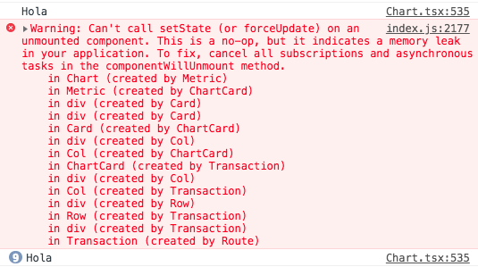

# 2018.07.10

今 tia 终于发工资啦啦啦~

不对，这不是重点 // 快速切换主题

在 React 中，切换页面后，unmount 页面的组件如果存在事件监听而在 `componentWillUnmount ` 中并没有移除监听，那么组件将会驻留在内存导致内存泄露 ( Memory Leak )，需要注意。

场景恢复：

在一个组件中 ( chart.tsx ) 中用 mobx 的 reaction 监听了 `variateStore` 中的一个属性，但是并没有在 `componentWillUnmount` 中去移除；

```js
reaction(
  () => this.variateStore.displayEvents,
  (displayEvents) => {
    if (this.props.resultSets.events) {
      console.log("Hola")
      const isCurrType = item => displayEvents.indexOf(item.type) > -1;
      this.pushPlotLine(R.filter(isCurrType, this.props.resultSets.events));
    }
  }
);
```

碰巧的是，在 `pushPlotLine` 函数中使用了 `setState` 方法，所以导致 React 报错：

可以看到切换页面后，`reaction` 中的回调函数被仍然被执行了，并且报错：



::: danger Error
Can't call setState (or forceUpdate) on an unmounted component. This is a no-op, but it indicates a memory leak in your application. To fix, cancel all subscriptions and asynchronous tasks in the componentWillUnmount method.
:::

React 也非常贴心的告诉我需要在 `componentWillUnmount` 去移除监听或者异步事件。

解决方案：

添加一个 `rection` 存储当前组件的 `rection` ，用于之后的在移除监听。

```js
reaction(
  () => this.variateStore.displayEvents,
  (displayEvents, _reaction) => {
    this.reaction = _reaction;
    if (this.props.resultSets.events) {
      console.log("Hola")
      const isCurrType = item => displayEvents.indexOf(item.type) > -1;
      this.pushPlotLine(R.filter(isCurrType, this.props.resultSets.events));
    }
  }
);
```

在 `componentWillUnmount` 中移除：

```js
componentWillUnmount() {
  this.rection.dispose();
}
```

移除了组件的监听事件，那么 React 就将会在页面 Unmount 的时候把该组件从内存中移除，从而解决内存泄露的问题。

噫嘻嘻~

// 又回来了 -=-

发现一个 BUG，在状态没有变更的时候 `reaction` 的 `effect` 回调并不会自执行，所以 `this.reaction` 为 `undefined`，这时候 unmount 的时候就会报错，看了下源码，发现 `reaction` 就是返回的一个 `IReactionDisposer` 对象，

```js
export declare function reaction<T>(expression: (r: IReactionPublic) => T, effect: (arg: T, r: IReactionPublic) => void, opts?: IReactionOptions): IReactionDisposer;
```

所以直接将其赋值给一个变量：

```js
this.reactionDisposer = reaction(
  () => this.variateStore.displayEvents,
  (displayEvents, _reaction) => {
      // this.reaction = _reaction;
    console.log("Hola");
    if (this.props.resultSets.events) {
      const isCurrType = item => displayEvents.indexOf(item.type) > -1;
      this.pushPlotLine(R.filter(isCurrType, this.props.resultSets.events));
    }
  }
);
```

接下来在 `componentWillUnmount` 的时候直接调用就好了：

```js
componentWillUnmount() {
  if (this.reactionDisposer) { this.reactionDisposer(); }
}
```

填坑完毕！